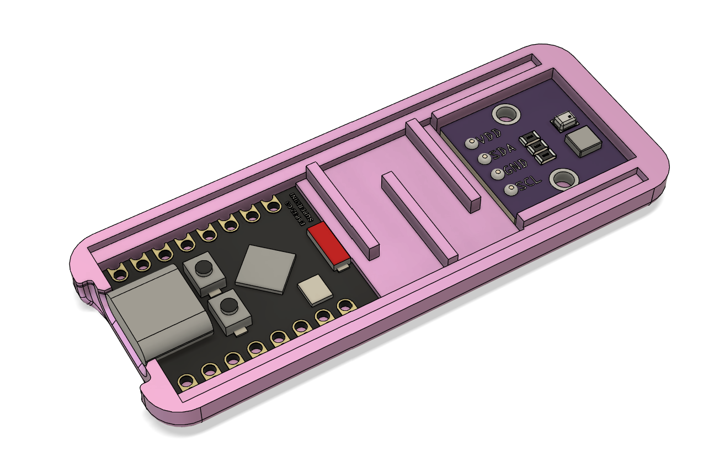

# ESP32-CE_HTTPS_Thermometer
This project implements thermometer using an ESP32-C3 SuperMini and an AHT20+BMP280 sensor module. It measures:
- Temperature (°C)
- Relative humidity (%)
- Atmospheric pressure (kPa)

# Hardware Assembly
The components are assembled with a simple 3D printed case and connected via soldered wires according to the following table:

| ESP32-C3 Super Mini Pin | I2C Thermometer Pin | 
|-------------------------|---------------------|
| `3V3`                   | `VCC` (or `VIN`)    |
| `GND`                   | `GND`               |
| `GPIO4` (SCL)           | `SCL`               |
| `GPIO5` (SDA)           | `SDA`               | 

# Data Integration

Data is transmitted to  for cloud storage and dashboard visualization.

Firmware Options
  -  Configure WiFi credentials directly in the code variables.
  -  On startup, the device creates a WiFi hotspot. By connecting to it, you can configure the proper WiFi network for permanent use. Network credentials are saved to EEPROM, them on the next starup it will atomaticaly reconect.
